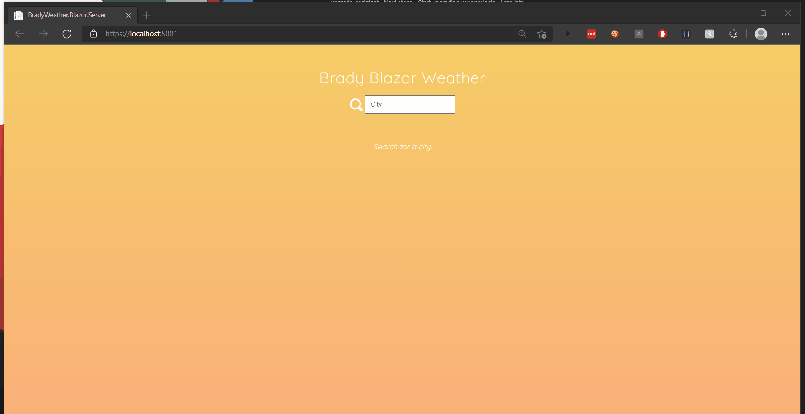

## DevOps Engineer - technical interview

### Testing goals
With this test, we want to see your ability to create an entire CI/CD pipeline and infrastructure from scratch as well as your skills as a system administrator.

We are testing your ability to implement modern automated infrastructure, as well as general knowledge of system administration. In your solution you should emphasize readability, maintainability and DevOps methodologies.

### The application

The app is a simple weather lookup by user entered locations. 

- The app is built with dotnet core sdk version 3.1
- The app uses [AccuWeather API](https://developer.accuweather.com/accuweather-locations-api/apis) for lcoations lookup
  -  You will need to create a free account with [AccuWeather](https://developer.accuweather.com/) in order to register an application and call their API.
- The startup application is **BradyWeather.Blazor.Server.csproj**

At the end of the exercise the application should look like below.  

### The task
Your task is to automate the deployment and provisioning of resources that host the app provided.
It should be hosted in a highly available and scalable web application hosted in **Azure**.   

Your CI job should:
- Investigate and understand which values need to be swapped as part of CICD pipeline. This needs done for the application to work :)  
- Run when a feature branch is pushed to Github (you should fork this repository to your Github account). 
- Deploy to a target environment when the job is successful.
- A clean minimumal working infrastructure is preferred than a full blown solution pieced together with scissors, rope and duct tape. 
- Consider security.
- Consider tests at all levels. 

### Submission
- Create a public Github repository and push your solution into it.
- Include a README which desribes how any CI pipelines and IAC works
  - Also a link the site. 

### Bonus Points
- Commit often - would rather see a history of trial and error than a single push. 
- Versioning of the deployment
- Write some tests for code and integrate into pipeline